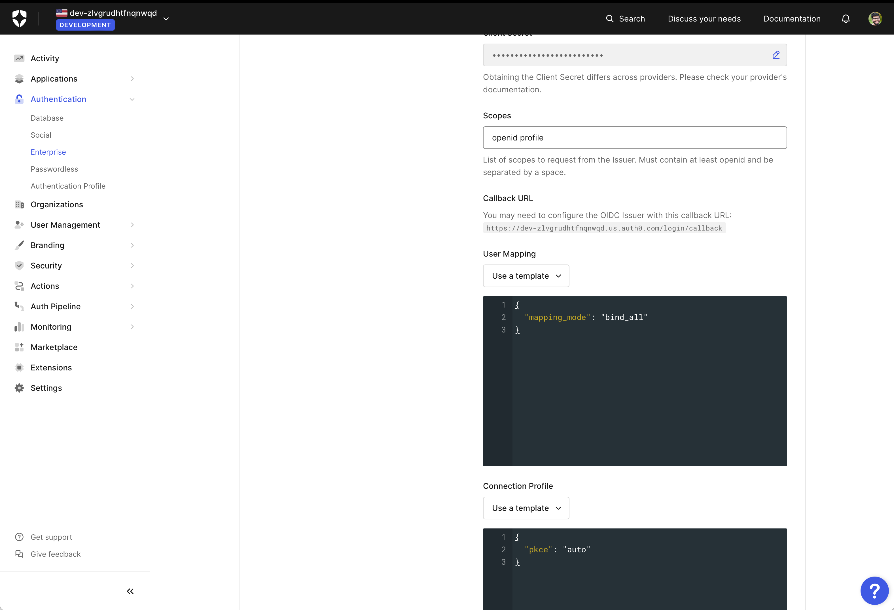

# Auth0
<Subtitle>Learn how to integrate Scalekit with Auth0 via OpenID Connect (OIDC)</Subtitle>

## Introduction
This guide is designed to provide you a walkthrough of integrating Scalekit with Auth0, thereby facilitating seamless Single Sign-on (SSO) authentication for your application's users. We demonstrate how to configure Scalekit so that Auth0 can continue to act as the identity management solution for your users and manage the login, session management functionality. 

To begin, here is an overview of the SSO workflow.

<figure>
<figcaption>Scalekit - Auth0 Integration</figcaption></figure>


Scalekit is designed as a fully compatible OpenID Connect (OIDC) provider, thus streamlining the integration. As Auth0 continues to act as your identity management system, you'll be able to seamlessly integrate Single Sign-On into your application without having to write code.

## Before getting started

**Note** that Auth0 classifies OpenID Connect as Enterprise Connection and this feature is available only in the paid plans of Auth0. Please check whether your current plan has access to creating Enterprise Connections with OpenID Connect providers. 

Ensure you have: 
- access to Auth0's Authenticate dashboard. You need to have a role as an 'Admin' or 'Editor - Connections' to create and edit OIDC connections on Auth0.
- access to your Scalekit dashboard.

## Integrate Scalekit with Auth0

### 1. Add Scalekit as OIDC connection

:::info Note
Because of an [existing issue](https://community.auth0.com/t/creating-an-oidc-connection-fails-with-options-issuer-is-required-error/128189) in adding OIDC connections via Auth0 Management Console, you need to use Auth0 API to create OIDC connection.
:::

Use [Auth0 Connections API](https://auth0.com/docs/api/management/v2/connections/post-connections) to create Scalekit as a OpenID connection for your tenant. Sample curl command below:
```bash showLineNumbers

curl --request POST \
  --url 'https://<AUTH0_TENANT_DOMAIN>.us.auth0.com/api/v2/connections' \
  -H 'Content-Type: application/json' \
  -H 'Accept: application/json' \
  --header 'authorization: Bearer <API_TOKEN>' \
  --data '{ "strategy": "oidc", "name": "Scalekit", "options": { "type": "back_channel", "discovery_url": "<SCALEKIT_ENV_URL>/.well-known/openid-configuration", "client_secret" : "<SCALEKIT_CLIENT_SECRET>", "client_id" : "<SCALEKIT_CLIENT_ID>",  "scopes": "openid profile" } }'

```

To configure Scalekit OIDC credentials like client_id, client_secret, we recommend you to store these as environment variables. Sample .env file below:

```jsx title=".env"
SCALEKIT_ENVIRONMENT_URL="<https://yoursaas-dev.scalekit.com>"
SCALEKIT_CLIENT_ID="skc_122056050118122349527"
SCALEKIT_CLIENT_SECRET="test_CbGfKxzwUVO6ISirRcTKMbcX3dsfdsfdsfsdfdsfsdfGmXLN"
```

After the successful execution of the above API call, you will see a new OpenID connection created in your Auth0 tenant. To conifrm this, you can navigate to [Enterprise Connections](https://auth0.com/docs/authenticate/enterprise-connections#view-enterprise-connections) in your Auth0 dashboard.


### 2. Add Redirect URI in Scalekit

After creating Scalekit as a new OIDC connection, you need to copy the Callback URL from your Auth0 Dashboard and add it as a new Redirect URI in your Scalekit API Config section.

#### 2a. Copy Callback URL from Auth0
In your Auth0 dashboard, go to Authentication > Enterprise > OpenID Connect > Scalekit > Settings. 
Copy the "Callback URL" that's available in the General section of settings.




#### 2b. Set Redirect URI in Scalekit API Config
Go to your Scalekit dashboard. Select environment as Development or Production. Navigate to the "API Config" in the Settings (left nav). In the Redirect URIs section, select **Add new URI**. Paste the Callback URL that you copied from Auth0 dashboard. Click on Add button.


### 3. Enable Home Realm Discovery

After you have successfully configured Scalekit as OIDC connection in your Auth0 tenant, it's time to onboard your enterprise customers and enable home realm discovery for their email domains. This helps your application users to be automatically routed to SSO login experience. 

The users email domain will be compared with the identity provider domains. If there is a match, users will be redirected to the SSO login through the identity provider. If there is no match, users will be prompted to enter their password.

In your Auth0 dashboard, go to Authentication > Enterprise > OpenID Connect > Scalekit > Login Experience.
Navigate to "Home Realm Discovery" in the Login Experience Customization section.

In the Identity Provider domains, add app.scalekit.com in the comma separated list of domains. 
Example: app.yoursaas.com, app.scalekit.com

**Press Save** to save Home Realm Discovery settings. Screenshot below for reference:


