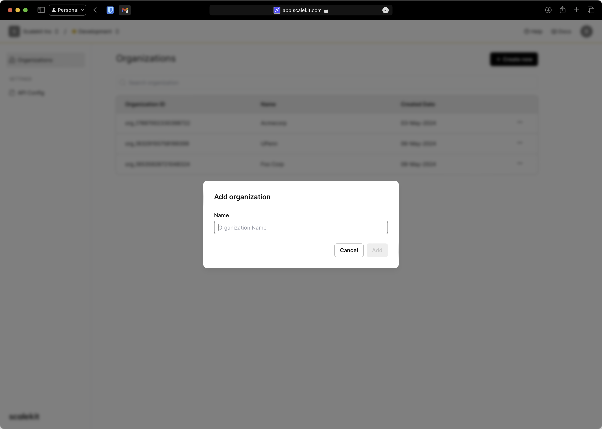
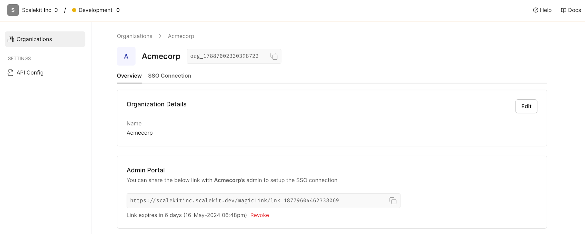

# Manage Organizations

## Overview
Organizations represent your customers or accounts in your application. For your every customer who needs to use Single Sign-on to login to your application, you would create an organization in Scalekit Dashboard and configure their Single Sign-on settings in that organization.

You can view all the organizations that are configured for your application by navigating to the **Organizations** section in your Scalekit Dashboard. Example screenshot shown below.
<figure>
<figcaption>Organizations View</figcaption></figure>

## Create Organization
You can create an Organization by clicking on the **Create New** button in the Organizations section. Enter the name of the organization and click **Add** to create that organization. 

<figure>
<figcaption>Create an Organization</figcaption></figure>

After the organization is successfully created, you are redirected to the newly created organization's Overview tab. From here, you can enable Single Sign-on and configure Home Realm Discovery for this newly created organization.

## Enable Home Realm Discovery
**Home Realm Discovery (HRD)** is the process that allows Scalekit to determine which identity provider (IdP) a user needs to authenticate with at the time of log-in. Based on the domain portion of the user's email address, Scalekit determines the organization and thus the SSO Connection that needs to be used to authenticate the user. 

To enable seamless Home Real Discovery, configure the domains that need to be mapped to an organization by adding all the relevant domains in the **Domains** section of the Overview tab. Example screenshot shown below.
<figure>
<figcaption>Organization - Domain configuration</figcaption></figure>

:::info
Ensure you add only the domains that you know are owned by this organization. 

Coming Soon: Self Serve DNS based domain verification for your organizations.
:::

## Generate Admin Portal Link
Admin Portal is a self-service interface that empowers your customers' IT admins to configure SSO on their own. Designed to streamline the SSO setup process, it reduces the demand on your engineering resources and provides comprehensive IdP-specific documentation. Fully hosted and managed by Scalekit, the Admin Portal simplifies the SSO config experience, ensuring a fast and secure integration with only a few lines of code.

In the **Admin Portal** section of the Overview tab, click 'Generate Link' to create a new, shareable Admin Portal link. Copy this link and share it with your customer's IT admin to let them enable Single Sign-on between their Identity Provider and your application. 
<figure>
<figcaption>Organization - Admin Portal Link</figcaption></figure>

## Manage SSO Connections
You can monitor the SSO configuration process to assist your customers by navigating to the **SSO Connection** tab. You can also modify and configure the Single Sign-on details on behalf of your customer, if you have all the necessary information about your customer's Identity provider. 

Example screenshot below.
<figure>
<figcaption>Organization - SSO Connection tab</figcaption></figure>