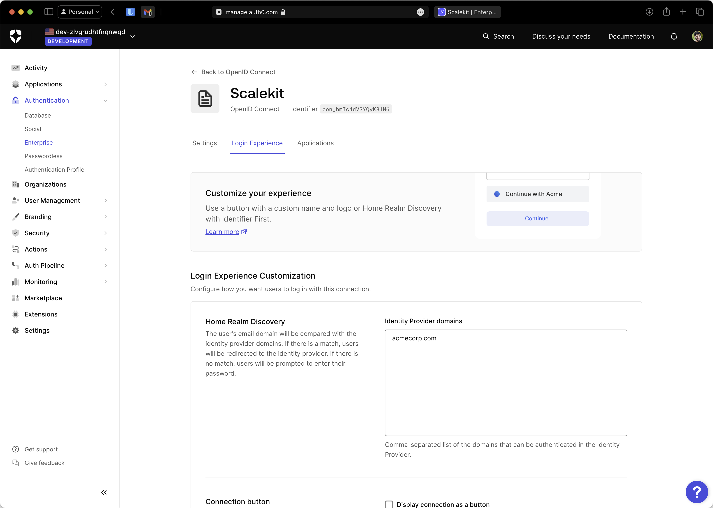

import Subtitle from '@site/src/components/custom';

# Auth0
<Subtitle>axcd</Subtitle>

## Introduction
This guide is designed to streamline the integration of Scalekit with Auth0 applications, thereby facilitating seamless Single Sign-on (SSO) Authentication for your users. We will walk you through the process of configuring your Auth0 tenant with Scalekit.

To begin, we'll start with an overview of the SSO workflow, laying the foundation for the subsequent integration steps.


Scalekit is engineered as a fully compatible OpenID Connect Provider, thus streamlining the integration process. We'll demonstrate how to configure Scalekit so that Auth0 can automatically handle much of the workflow. As Auth0 manages the integration with Scalekit, you'll be able to seamlessly integrate Single Sign-On capability into your product without having to write a single line of code.

## Pre-requisites

- Ensure you have access to Auth0 Management Dashboard. **Please note** that OpenID Connect feature is only available in some pricing plans of Auth0. Please check whether your current plan has access to creating Enterprise Connections with OpenID Connect providers. 
- Access to your Scalekit account


## Setting up Auth0

### Adding Scalekit as OpenID Connect Connection

:::info Note
Because of an [existing issue](https://community.auth0.com/t/creating-an-oidc-connection-fails-with-options-issuer-is-required-error/128189) in adding OIDC Providers via Auth0 Management Console, you are required to use Auth0 API to create OpenID Connect Connections via API 
:::

You need to use the Auth0 Management API to create Scalekit as a OpenID connection for your tenant. See the sample curl command below

```bash showLineNumbers

curl --request POST \
  --url 'https://<AUTH0_TENANT_DOMAIN>.us.auth0.com/api/v2/connections' \
  -H 'Content-Type: application/json' \
  -H 'Accept: application/json' \
  --header 'authorization: Bearer <API_TOKEN>' \
  --data '{ "strategy": "oidc", "name": "Scalekit", "options": { "type": "back_channel", "discovery_url": "<SCALEKIT_ENV_URL>/.well-known/openid-configuration", "client_secret" : "<SCALEKIT_CLIENT_SECRET>", "client_id" : "<SCALEKIT_CLIENT_ID>",  "scopes": "openid profile" } }'

```

After the successful execution of the above API call, you will see a new OpenID Connect Connection created in your Auth0 tenant.

### Add Redirect URI in Scalekit API Config

After creating Scalekit as a new OIDC connection, you need to copy the Callback URL from your Auth0 Dashboard and add it as a new Redirect URI in your Scalekit API Config section.


## Enable Home Realm Discovery

After you have successfully configured Scalekit as OIDC provider in your Auth0 project, it's time to onboard your enterprise customers and enable home realm discovery for their domains so that they will be automatically routed to SSO connection based on their email domain and Auth0 will route the requests to Scalekit.



